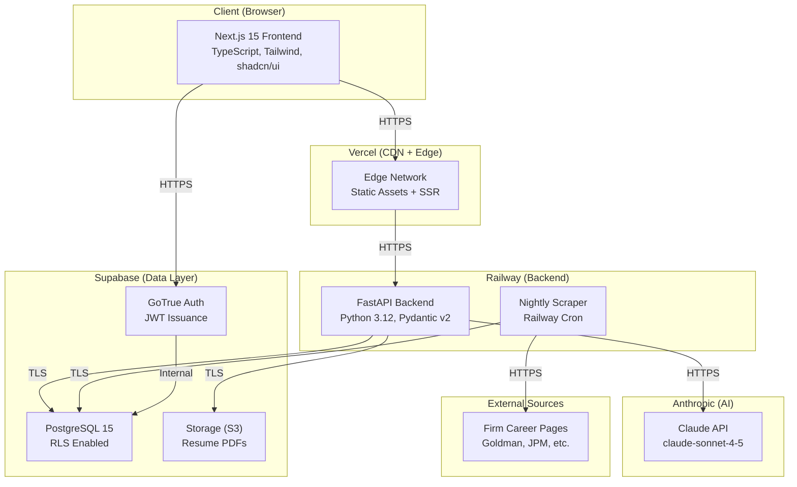
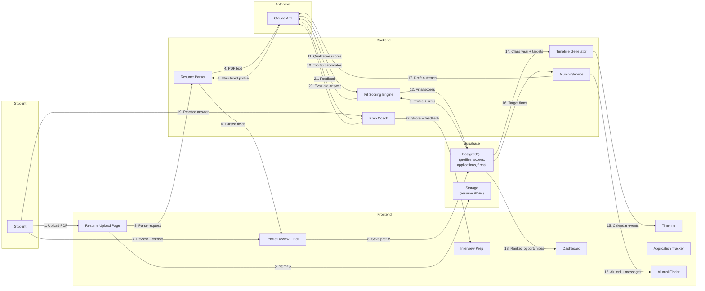
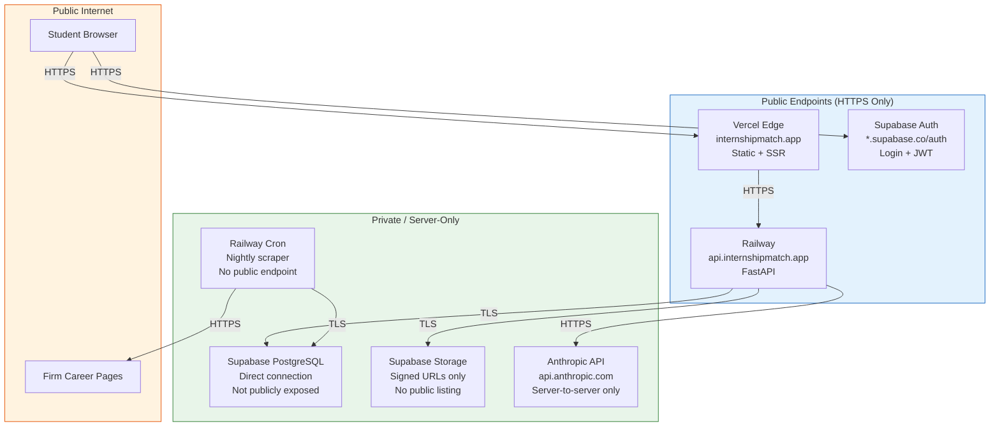
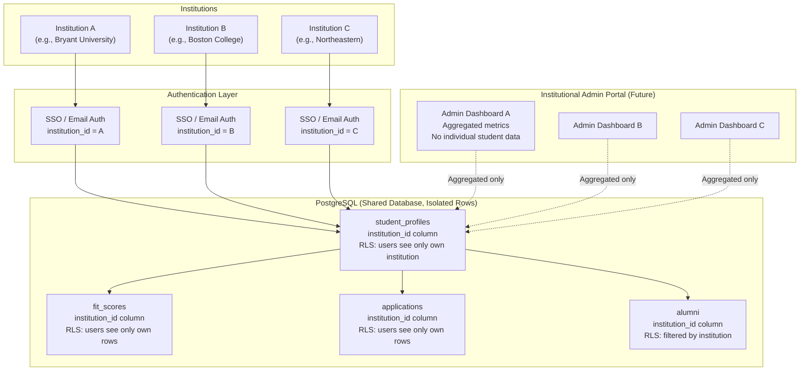

# InternshipMatch -- Architecture Diagrams

**Document version:** 1.0
**Last updated:** 2026-04-20
**Prepared by:** Owen Ash, Bryant University
**Contact:** security@internshipmatch.app

---

## 1. High-Level System Architecture

This diagram shows the major components of InternshipMatch and how they connect.

---

## 2. Data Flow Diagram

This diagram traces how student data flows through the system, from upload to dashboard.

### Data Flow Notes

| Step | Data Involved | Encryption | Persisted? |
|------|-------------|-----------|-----------|
| 1-2 | Resume PDF | TLS in transit, AES-256 at rest | Yes (Supabase Storage) |
| 3-5 | Resume text | TLS in transit | No (transient in Anthropic, deleted after 30 days) |
| 6-8 | Parsed profile (name, GPA, coursework, etc.) | TLS in transit, AES-256 at rest | Yes (PostgreSQL) |
| 9-12 | Profile fields + fit scores | TLS in transit, AES-256 at rest | Yes (PostgreSQL) |
| 10-11 | Profile summary for qualitative scoring | TLS in transit | No (transient in Anthropic) |
| 17 | Alumni info + student profile for outreach draft | TLS in transit | No (transient in Anthropic) |
| 19-21 | Practice answers + feedback | TLS in transit | Feedback persisted; raw answers optional |

---

## 3. Network Boundary Diagram

This diagram shows the trust boundaries: what is publicly accessible, what is private, and how traffic flows between zones.

### Boundary Rules

| Component | Publicly Accessible? | Authentication Required? | Notes |
|-----------|---------------------|-------------------------|-------|
| Vercel (frontend) | Yes | No (static assets); Yes (app pages redirect to login) | Landing page is public; all app routes require auth |
| Railway API | Yes (HTTPS endpoint) | Yes (Supabase JWT required on all routes) | CORS restricted to frontend domain |
| Supabase Auth | Yes (auth endpoints) | N/A (this is the auth service) | Rate-limited by Supabase |
| Supabase PostgreSQL | No | Yes (connection string + RLS) | Only accessible from Railway backend |
| Supabase Storage | No (no public listing) | Yes (signed URLs generated server-side) | Resume PDFs require authenticated, time-limited URLs |
| Anthropic API | No | Yes (API key, server-side only) | API key never exposed to browser |
| Railway Cron | No | N/A (internal process) | No public endpoint; runs on schedule |

### Key Security Boundaries

1. **The Supabase service role key never leaves the backend.** It is stored as a Railway environment variable and used only for server-side operations.
2. **The Anthropic API key never leaves the backend.** All Claude API calls are made server-to-server.
3. **Resume PDFs are not publicly accessible.** Access requires a signed URL generated by the backend after verifying the requesting user owns the file.
4. **The scraper has no public endpoint.** It runs as an internal cron job and writes directly to the database.

---

## 4. Tenant Isolation Diagram (Future State)

InternshipMatch is designed for multi-tenant operation when serving multiple institutions. This diagram shows the planned isolation model using an `institution_id` column.

### Isolation Model Details

| Layer | Isolation Method | Status |
|-------|-----------------|--------|
| Authentication | Email domain restriction or SAML SSO per institution | Current: email domain; Future: SAML |
| Database rows | `institution_id` foreign key on all user-owned tables | Future (single-tenant for pilot) |
| Row-Level Security | RLS policies filter by `institution_id` AND `user_id` | Future (current RLS filters by `user_id` only) |
| Storage | Resume PDFs stored with `institution_id` prefix in path | Future |
| Admin access | Institution admins see only their institution's aggregated data | Future |
| Firm database | Shared across all institutions (firms are not institution-specific) | Current |
| Scraper data | Shared across all institutions (postings are public) | Current |

### Cross-Tenant Data Guarantees

- No student at Institution A can view, search, or infer the existence of students at Institution B
- Institutional admins cannot access individual student records (only aggregated, de-identified metrics)
- Alumni data is filtered by institution; no cross-institution alumni browsing
- Fit scores and application records are fully isolated per user and per institution
- The shared firm and postings tables contain no student data and pose no isolation risk

---

## 5. Diagram Rendering

All diagrams in this document use [Mermaid](https://mermaid.js.org/) syntax. They can be rendered in:

- GitHub (native Mermaid support in Markdown)
- VS Code (with the Mermaid preview extension)
- [Mermaid Live Editor](https://mermaid.live/)
- Any documentation platform that supports Mermaid (Notion, Confluence, etc.)
